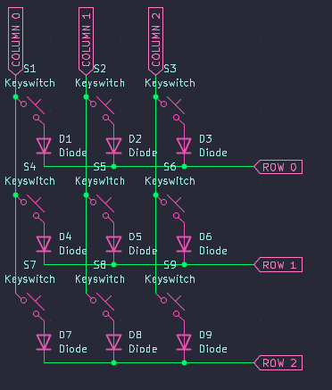
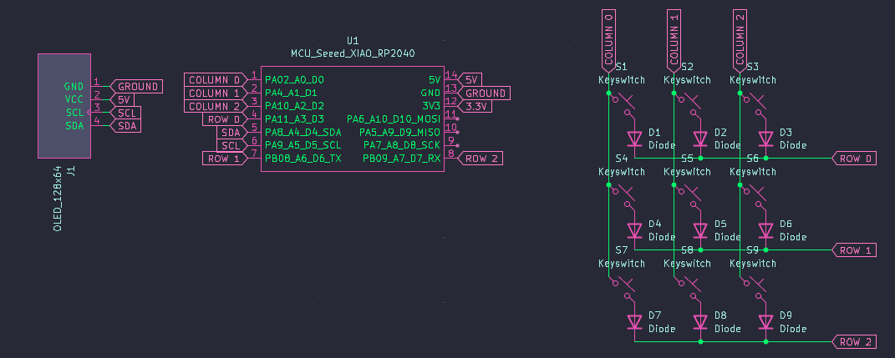
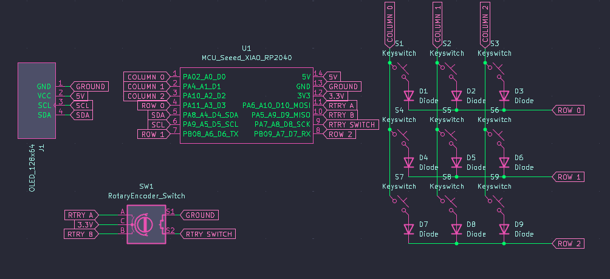
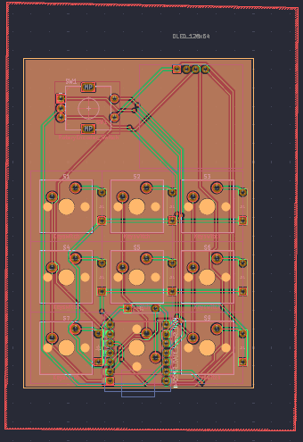
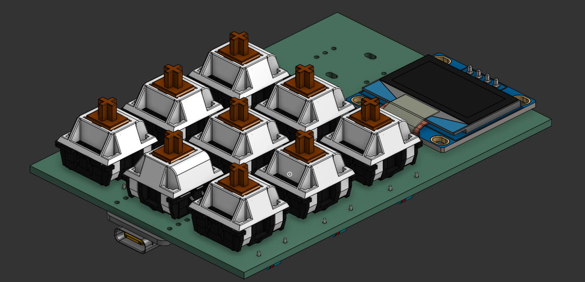
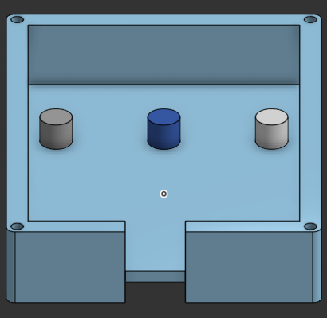
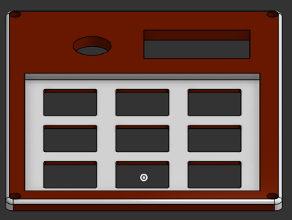
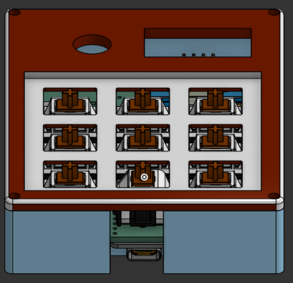

# ChaosPad Journal
## 24th of May: Started on the project!
Since I have no idea as to how PCBs are made an work, I started by watching the following videos (can highly recommend them😁):
- [DIY Macro Pad Keyboard Build from Scratch - Salim Benbouziyane](https://www.youtube.com/watch?v=P_oSLBZABGA)
- [How to Design Mechanical Keyboard PCBs with Kicad - Joe Scotto](https://www.youtube.com/watch?v=8WXpGTIbxlQ&t=1052s)
- [How a Mechanical Keyboard Works (Matrix and Direct Wiring)](https://www.youtube.com/watch?v=7LyziNdFlew)
- [How to Design Mechanical Keyboard Plates and Cases](https://www.youtube.com/watch?v=7azQkSu0m_U&t=264s)

After watching these videos I had a rough idea of how I want the macropad to look like, and how I want it to work. The main problem was that I wanted a 4x4 pad along with a screen, but the Xiao didn't have enough pins for that. After more research, I found out that I could use an IO expander to get more pins, but I was already way in over my head and decided against it.

So, I wired a simple 3x3 matrix:

Followed by wiring up the screen, for which I decided to use the 128x64 SSD1306 OLED display due to its convenient form factor (I was planning on having it on the top right with the Xiao on the top left).

Only now did I realise that I had made a stupid mistake and forgot that the 5v and GND pins would not be connected to digital pins, so I did indeed have enough pins for the 4x4 matrix, but I did not want to rewire the matrix, so I decided to use those pins for something else instead. 

For the change, I decided to use a rotary encoder because I thought it would be a nice addition to control the volume/brightness or to scroll through added layers if I decided to add them later on.

**Total time spent: 5.5h**

## 25th of May: Got the PCB finished
Today was a pretty easy day, I had done a good job with the schematics, so all of the traces were highlighted and I had an easy time routing the PCB. The only challenge was trying to fit it on the form factor I wanted (a long-ish rectangle), but I managed to do it in the end.

I tried to keep the PCB as simple and small as possible, and kept the screen and the rotary encoder on the top because that's the aesthetic I liked.

**Total time spent: 2h**

## 28th of May: Designing the case
Today I wanted to finish the case design. I decided to use [OnShape](https://www.onshape.com/en/) for the case design as I was already familiar with it and I wanted to keep my job as simple as possible. 

Again decisions I had made earlier made my job a lot easier as I was able to simply export the 3D model of the PCB and the screen from KiCad and import them into OnShape. 

From here, I just sculpted the case around the PCB and the screen, knowing that it would be an almost perfect outcome.

For the base, I decided to go for a simple rectangular shape with a slight angle to make it more comfortable to use. Along with a cutout for the USB-C port, I also added some supporting pillars to hold the PCB in place and to make sure that it wouldn't move around too much.

For the top, I decided to go for a simple flat design with a cutout for the screen and the rotary encoder. I also added some holes for the screws to hold the top and bottom together. I then rounded the edges to make it look more aesthetically pleasing and more comfortable to interact with. To finish it off, 

Added together, the case looks like this:

I am really pleased with the result, and I think it looks really nice. I also made sure that the case is easy to print and that it doesn't require any support material, so it should be easy to print on most printers.

At the end of the day, I also wrote the firmware which didn't take too long thanks to [KMK](https://github.com/KMKfw/kmk_firmware).

**Total time spent: 5h**

## 31st of May: Finalising
Just adding finishing touches to the repo, and adding a BOM + uploading this journal to GitHub.

**Total time spent: 0.5h**